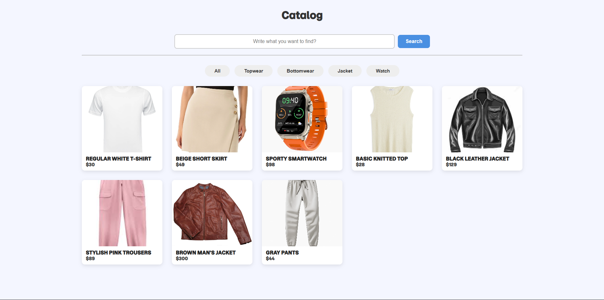

# 🛍️ Product Cards — Мини интернет-магазин на чистом HTML, CSS и JS

Небольшой проект в стиле интернет-магазина, где каждая карточка представляет товар с изображением, названием и ценой.  
Создан с упором на адаптивный дизайн, анимации и аккуратное визуальное оформление — как на настоящих маркетплейсах.

---



---

## ✨ Возможности

- 🧩 Отображение карточек товаров в сетке  
- 🎨 Адаптивный дизайн — красиво выглядит на любых устройствах  
- 🖱️ Плавные анимации при наведении  
- 🔍 Поиск по товарам  
- ⚙️ Кнопки фильтров (пример функциональности для будущего расширения)  
- 💡 Чистый HTML, CSS и JavaScript — без фреймворков  

---

## 🧠 Идея проекта

Цель — создать визуально приятный интерфейс карточек товаров и потренироваться с вёрсткой, стилями и интерактивом на JavaScript.  
Этот проект — отличная база, которую можно превратить в полноценный магазин или каталог продуктов с фильтрацией, корзиной и API.

---

## 🚀 Технологии

- **HTML5** — структура страницы  
- **CSS3 (Grid, Flexbox)** — адаптивная сетка и визуальные эффекты  
- **JavaScript (Vanilla JS)** — логика фильтров, поиска и интерактива  
- **Google Fonts (Momo Trust Display)** — фирменный шрифт для оформления  

---
## 🧩 Как запустить проект

1. Клонируй репозиторий:
   ```bash
   git clone https://github.com/username/product-cards.git
   ```
      
3. Открой файл:
   ```bash
   Открой файл index.html в браузере.
   ```


👨‍💻 Автор

Exmar — Fullstack Developer

📧 Telegram: @Exmar1
